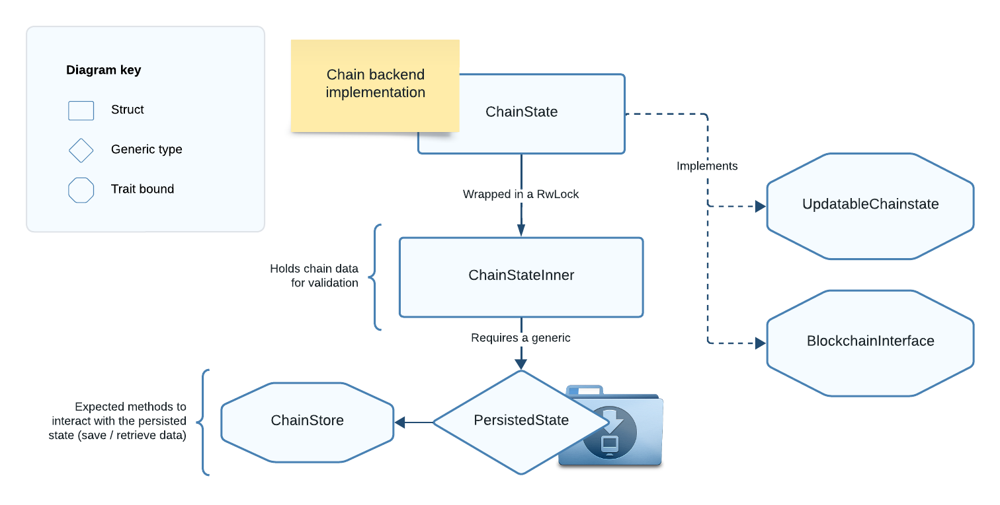

# Using ChainState as Chain Backend

> Recall that `UtreexoNode` is the high-level component of Floresta that will interact with the P2P network. It is made of its `Context` and a `NodeCommon` that holds a `Chain` backend (for validation and state tracking). This and the following chapters will focus solely on the Floresta chain backend.

In this chapter we will learn about `ChainState`, a type that implements `UpdatableChainstate + BlockchainInterface`, so we can use it as `Chain` backend.

`ChainState` is the **default blockchain backend** provided by Floresta, with all its logic encapsulated within the `floresta-chain` library.

The following associations clarify the module structure:

- `UtreexoNode` declaration and logic resides in `floresta-wire`
- `ChainState` declaration and logic resides in `floresta-chain`

### ChainState Structure

> The job of `ChainState` is to **validate blocks, update the state and store it**.

For a node to keep track of the chain state effectively, it is important to ensure the state is persisted to some sort of storage system. This way the node progress is saved, and we can recover it after the device is turned off.

That's why `ChainState` uses a generic `PersistedState` type, bounded by the `ChainStore` trait, which defines how we interact with our persistent state database.



*Figure 2: Diagram of the ChainState type.*

Filename: pruned_utreexo/chain_state.rs

```rust
# // Path: floresta-chain/src/pruned_utreexo/chain_state.rs
#
pub struct ChainState<PersistedState: ChainStore> {
    inner: RwLock<ChainStateInner<PersistedState>>,
}
```

```rust
# // Path: floresta-chain/src/pruned_utreexo/chain_state.rs
#
impl<PersistedState: ChainStore> BlockchainInterface for ChainState<PersistedState> {
    // Implementation of BlockchainInterface for ChainState
```

```rust
# // Path: floresta-chain/src/pruned_utreexo/chain_state.rs
#
impl<PersistedState: ChainStore> UpdatableChainstate for ChainState<PersistedState> {
    // Implementation of UpdatableChainstate for ChainState
```

As Floresta is currently only pruned, the expected database primarily consists of the block header chain and the utreexo accumulator; blocks themselves are not stored.

The default implementation of `ChainStore` is `KvChainStore`, which uses a key-value store. This means that developers may:

- Implement custom `UpdatableChainstate + BlockchainInterface` types for use as `Chain` backends.
- Use the provided `ChainState` backend:
    - With their own `ChainStore` implementation.
    - Or the provided `KvChainStore`.

Next, let’s build the `ChainState` struct step by step!
