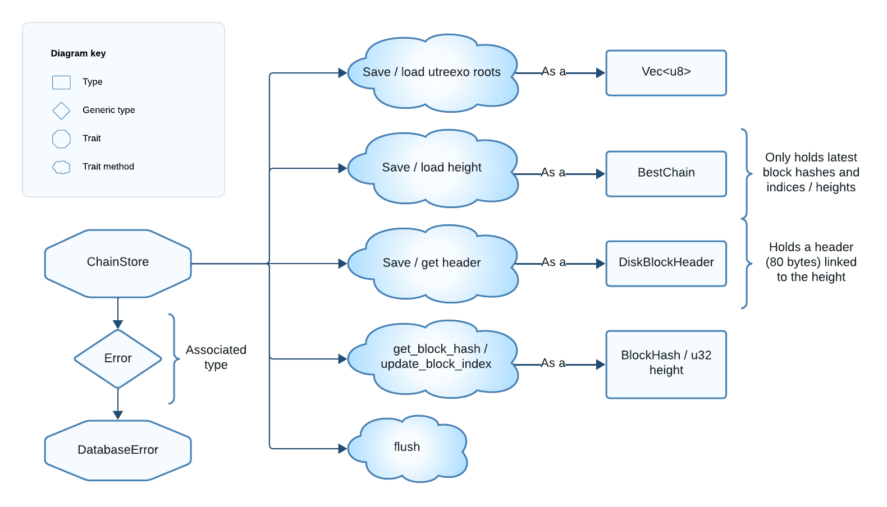

## The ChainStore Trait

> `ChainStore` is a trait that abstracts the persistent storage layer for the Floresta `ChainState` backend.

To create a `ChainState`, we start by building its `ChainStore` implementation. We will see the required interface and then take a look at the provided `KvChainStore`.

### ChainStore API

The methods required by `ChainStore`, designed for interaction with persistent storage, are:
- `save_roots` / `load_roots`: Save or load the utreexo accumulator (merkle roots).
- `save_height` / `load_height`: Save or load the current chain tip data.
- `save_header` / `get_header`: Save or retrieve a block header by its `BlockHash`.
- `get_block_hash` / `update_block_index`: Retrieve or associate a `BlockHash` with a chain height.
- `flush`: Immediately persist saved data still in memory. This ensures data recovery in case of a crash.
- `check_integrity`: Performs a database integrity check. This can be a no-op if our implementation leverages a database crate that ensures integrity.

In other words, the implementation of these methods should allow us to save and load:

- The current accumulator (serialized as a `Vec<u8>`).
- The current chain tip data (as `BestChain`).
- Block headers (as `DiskBlockHeader`), associated to the block hash.
- Block hashes (as `BlockHash`), associated to a height.

`BestChain` and `DiskBlockHeader` are important Floresta types that we will see in a minute. `DiskBlockHeader` represents stored block headers, while `BestChain` tracks the chain tip metadata.

With this data we have a pruned view of the blockchain, metadata about the chain we are in, and the compact UTXO set (the utreexo accumulator).



*Figure 3: Diagram of the ChainStore trait.*

`ChainStore` also has an associated `Error` type for the methods:

Filename: pruned_utreexo/mod.rs

```rust
# // Path: floresta-chain/src/pruned_utreexo/mod.rs
#
pub trait ChainStore {
    type Error: DatabaseError;

    fn save_roots(&self, roots: Vec<u8>) -> Result<(), Self::Error>;
    // ...
    # fn load_roots(&self) -> Result<Option<Vec<u8>>, Self::Error>;
    #
    # fn load_height(&self) -> Result<Option<BestChain>, Self::Error>;
    #
    # fn save_height(&self, height: &BestChain) -> Result<(), Self::Error>;
    #
    # fn get_header(&self, block_hash: &BlockHash) -> Result<Option<DiskBlockHeader>, Self::Error>;
    #
    # fn save_header(&self, header: &DiskBlockHeader) -> Result<(), Self::Error>;
    #
    # fn get_block_hash(&self, height: u32) -> Result<Option<BlockHash>, Self::Error>;
    #
    # fn flush(&self) -> Result<(), Self::Error>;
    #
    # fn update_block_index(&self, height: u32, hash: BlockHash) -> Result<(), Self::Error>;
    #
    # fn check_integrity(&self) -> Result<(), Self::Error>;
}
```

Hence, implementations of `ChainStore` are free to use any error type as long as it implements `DatabaseError`. This is just a marker trait that can be automatically implemented on any `T: std::error::Error + std::fmt::Display`. This flexibility allows compatibility with different database implementations.

Now, we’ll explore `KvChainStore`, Floresta’s default `ChainStore` implementation, to see how these methods are applied in practice.

### The KvChainStore Type

`KvChainStore` is a struct built with `kv`, a lightweight crate that wraps the `sled` high-performance embedded database. From the `kv` crate description:

> kv is a simple way to embed a key/value store in Rust applications. It is built using sled and aims to be as lightweight as possible while still providing a nice high level interface.

One of the main concepts in `kv` is the _bucket_, a collection of related key-value pairs. We use three buckets in `KvChainStore`:

- `index`: Maps heights (`K`) to block hashes (`V`) for quick block hash lookups by height.
- `header`: Maps block hashes (`K`) to block headers (`V`), enabling header retrieval by hash.
- `meta` (the default bucket), where `K` is a string:
    - If `K = "roots"`, the stored `V` is the utreexo accumulator.
    - If `K = "height"`, the stored `V` is the best chain data.

Filename: pruned_utreexo/chainstore.rs

```rust
# // Path: floresta-chain/src/pruned_utreexo/chainstore.rs
#
pub struct KvChainStore<'a> {
    _store: Store,
    headers: Bucket<'a, Vec<u8>, Vec<u8>>,
    index: Bucket<'a, Integer, Vec<u8>>,
    meta: Bucket<'a, &'a str, Vec<u8>>,
    headers_cache: RwLock<HashMap<BlockHash, DiskBlockHeader>>,
    index_cache: RwLock<HashMap<u32, BlockHash>>,
}
```

The first field holds the `kv::Store` itself, but it is not accessed directly; interaction with the database occurs through the buckets. We then find the `headers`, `index` and `meta` buckets, with serialized values.

Finally, `headers_cache` and `index_cache` are in-memory `HashMap`s, protected by locks for thread-safe reads/writes, to temporarily store header and index data before writing to disk.

#### KvChainStore Builder

Filename: pruned_utreexo/chainstore.rs

```rust
# // Path: floresta-chain/src/pruned_utreexo/chainstore.rs
#
impl<'a> KvChainStore<'a> {
    pub fn new(datadir: String) -> Result<KvChainStore<'a>, kv::Error> {
        // Configure the database
        let cfg = Config::new(datadir + "/chain_data").cache_capacity(100_000_000);

        // Open the key/value store
        let store = Store::new(cfg)?;

        Ok(KvChainStore {
            headers: store.bucket(Some("headers"))?,
            index: store.bucket(Some("index"))?,
            meta: store.bucket(None)?,
            _store: store,
            headers_cache: RwLock::new(HashMap::new()),
            index_cache: RwLock::new(HashMap::new()),
        })
    }
}
```

The `KvChainStore` builder function initializes the store in `datadir/chain_data` and configures a 100 MB cache for the sled [pagecache](https://en.wikipedia.org/wiki/Page_cache).

This cache reduces disk accesses by temporarily storing writes and retrieving frequently accessed data. However, this `kv`-specific cache is used exclusively for the `meta` bucket, as the `index` and `headers` buckets have their own `HashMap` cache.

Since `KvChainStore` uses `kv::Error`, we implement `DatabaseError` for it in _pruned_utreexo/error.rs_:

```rust
# // Path: floresta-chain/src/pruned_utreexo/error.rs
#
impl DatabaseError for kv::Error {}
```

Now, let's understand how we use the buckets and the `HashMap` caches.

#### ChainStore Trait Implementation

For the `save_roots`, `load_roots`, `save_height` and `load_height` methods, we directly use the `meta` bucket:

* We call `set` on the bucket to keep the data in the `sled` cache, which is eventually written to disk.
* We call `get` on the bucket to access data from the `sled` cache or directly read it from disk.

Filename: pruned_utreexo/chainstore.rs

```rust
# // Path: floresta-chain/src/pruned_utreexo/chainstore.rs
#
impl ChainStore for KvChainStore<'_> {
    type Error = kv::Error;
    fn load_roots(&self) -> Result<Option<Vec<u8>>, Self::Error> {
        self.meta.get(&"roots")
    }

    # fn check_integrity(&self) -> Result<(), Self::Error> {
        # Ok(())
    # }
    #
    fn save_roots(&self, roots: Vec<u8>) -> Result<(), Self::Error> {
        self.meta.set(&"roots", &roots)?;
        Ok(())
    }
    // ...
    # fn load_height(&self) -> Result<Option<BestChain>, Self::Error> {
        # if let Some(b) = self.meta.get(&"height")? {
            # let height = deserialize(&b).expect("infallible: came from `serialize(height)`");
            # return Ok(Some(height));
        # }
        #
        # Ok(None)
    # }
    #
    # fn save_height(&self, height: &BestChain) -> Result<(), Self::Error> {
        # let height = serialize(height);
        # self.meta.set(&"height", &height)?;
        # Ok(())
    # }
    #
    # fn get_header(&self, block_hash: &BlockHash) -> Result<Option<DiskBlockHeader>, Self::Error> {
        # match self.headers_cache.read().get(block_hash) {
            # Some(header) => Ok(Some(*header)),
            # None => {
                # let block_hash = serialize(&block_hash);
                # Ok(self
                    # .headers
                    # .get(&block_hash)?
                    # .and_then(|b| deserialize(&b).ok()))
            # }
        # }
    # }
    #
    # fn flush(&self) -> Result<(), Self::Error> {
        # // save all headers in batch
        # let mut batch = Batch::new();
        # for header in self.headers_cache.read().iter() {
            # let ser_header = serialize(header.1);
            # let block_hash = serialize(&header.1.block_hash());
            # batch.set(&block_hash, &ser_header)?;
        # }
        # self.headers.batch(batch)?;
        # self.headers_cache.write().clear();
        #
        # // save all index in batch
        # let mut batch = Batch::new();
        # for (height, hash) in self.index_cache.read().iter() {
            # let ser_hash = serialize(hash);
            # batch.set(&Integer::from(*height), &ser_hash)?;
        # }
        # self.index.batch(batch)?;
        # self.index_cache.write().clear();
        #
        # // Flush the header bucket
        # self.headers.flush()?;
        # // Flush the block index
        # self.index.flush()?;
        # // Flush the default bucket with meta-info
        # self.meta.flush()?;
        # Ok(())
    # }
    #
    # fn save_header(&self, header: &DiskBlockHeader) -> Result<(), Self::Error> {
        # self.headers_cache
            # .write()
            # .insert(header.block_hash(), *header);
        # Ok(())
    # }
    #
    # fn get_block_hash(&self, height: u32) -> Result<Option<BlockHash>, Self::Error> {
        # match self.index_cache.read().get(&height).cloned() {
            # Some(hash) => Ok(Some(hash)),
            # None => Ok(self
                # .index
                # .get(&Integer::from(height))?
                # .and_then(|b| deserialize(&b).ok())),
        # }
    # }
    #
    # fn update_block_index(&self, height: u32, hash: BlockHash) -> Result<(), Self::Error> {
        # self.index_cache.write().insert(height, hash);
        # Ok(())
    # }
}
```

On the other hand:

* The `update_block_index` and `save_header` methods do not use the buckets, rather they save the data on the `index_cache` and `headers_cache` `HashMaps`.
* The `get_block_hash` and `get_header` methods first try to read data from the `HashMap`, and if not found ask the bucket for a disk read.

```rust
# // Path: floresta-chain/src/pruned_utreexo/chainstore.rs
#
impl ChainStore for KvChainStore<'_> {
    # type Error = kv::Error;
    # fn load_roots(&self) -> Result<Option<Vec<u8>>, Self::Error> {
        # self.meta.get(&"roots")
    # }
    #
    # fn check_integrity(&self) -> Result<(), Self::Error> {
        # Ok(())
    # }
    #
    # fn save_roots(&self, roots: Vec<u8>) -> Result<(), Self::Error> {
        # self.meta.set(&"roots", &roots)?;
        # Ok(())
    # }
    #
    # fn load_height(&self) -> Result<Option<BestChain>, Self::Error> {
        # if let Some(b) = self.meta.get(&"height")? {
            # let height = deserialize(&b).expect("infallible: came from `serialize(height)`");
            # return Ok(Some(height));
        # }
        #
        # Ok(None)
    # }
    #
    # fn save_height(&self, height: &BestChain) -> Result<(), Self::Error> {
        # let height = serialize(height);
        # self.meta.set(&"height", &height)?;
        # Ok(())
    # }
    #
    # fn get_header(&self, block_hash: &BlockHash) -> Result<Option<DiskBlockHeader>, Self::Error> {
        # match self.headers_cache.read().get(block_hash) {
            # Some(header) => Ok(Some(*header)),
            # None => {
                # let block_hash = serialize(&block_hash);
                # Ok(self
                    # .headers
                    # .get(&block_hash)?
                    # .and_then(|b| deserialize(&b).ok()))
            # }
        # }
    # }
    #
    # fn flush(&self) -> Result<(), Self::Error> {
        # // save all headers in batch
        # let mut batch = Batch::new();
        # for header in self.headers_cache.read().iter() {
            # let ser_header = serialize(header.1);
            # let block_hash = serialize(&header.1.block_hash());
            # batch.set(&block_hash, &ser_header)?;
        # }
        # self.headers.batch(batch)?;
        # self.headers_cache.write().clear();
        #
        # // save all index in batch
        # let mut batch = Batch::new();
        # for (height, hash) in self.index_cache.read().iter() {
            # let ser_hash = serialize(hash);
            # batch.set(&Integer::from(*height), &ser_hash)?;
        # }
        # self.index.batch(batch)?;
        # self.index_cache.write().clear();
        #
        # // Flush the header bucket
        # self.headers.flush()?;
        # // Flush the block index
        # self.index.flush()?;
        # // Flush the default bucket with meta-info
        # self.meta.flush()?;
        # Ok(())
    # }
    #
    # fn save_header(&self, header: &DiskBlockHeader) -> Result<(), Self::Error> {
        # self.headers_cache
            # .write()
            # .insert(header.block_hash(), *header);
        # Ok(())
    # }
    // ...
    fn get_block_hash(&self, height: u32) -> Result<Option<BlockHash>, Self::Error> {
        match self.index_cache.read().get(&height).cloned() {
            // Found in the index_cache
            Some(hash) => Ok(Some(hash)),
            // Not found in the index_cache, so try to read from the index bucket
            None => Ok(self
                .index
                .get(&Integer::from(height))?
                .and_then(|b| deserialize(&b).ok())),
        }
    }

    fn update_block_index(&self, height: u32, hash: BlockHash) -> Result<(), Self::Error> {
        self.index_cache.write().insert(height, hash);
        Ok(())
    }
}
```

Thus, the `index_cache` and `headers_cache` data must be written to disk later using the `ChainStore::flush` method. This method also ensures that any pending writes in the `meta` bucket are committed to disk.

And that's all for this section! Next we will see two important types whose data is saved in the `ChainStore`: `BestChain` and `DiskBlockHeader`.

{{#quiz ../quizzes/ch02-01-the-chainstore-trait.toml}}
