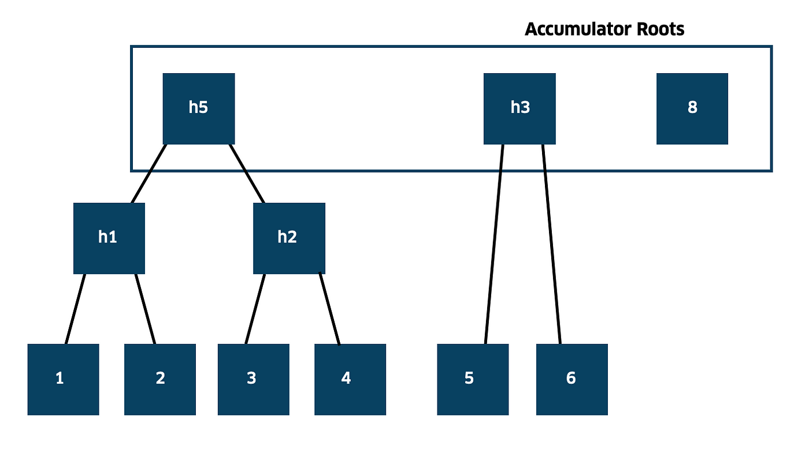

## Utreexo Validation

In the previous section we have seen the `Consensus::verify_block_transactions` function. It was taking a `utxos` argument, used to verify that each transaction input _satisfies the script_ of the UTXO it spends, and that transactions _spend no more than the sum of input amounts_.

However, we have yet to **verify that these `utxos` actually exist in the UTXO set**, i.e. check that nobody is spending coins out of thin air. That's what we are going to do inside `Consensus::update_acc`, and get the updated UTXO set accumulator, with spent UTXOs removed and new ones added.

> Recall that `Stump` is the type of our accumulator, coming from the `rustreexo` crate. `Stump` represents the merkle roots of a forest where leaves are UTXO hashes.



*Figure 4: A visual depiction of the utreexo forest. To prove that UTXO `4` is part of the set we provide the hash of UTXO `3` and `h1`. With this data we can re-compute the `h5` root, which must be identical. Credit: [original utreexo post](https://medium.com/interdax/utreexo-compressing-fully-validating-bitcoin-nodes-4174d95e0626).*

In the function we start by getting the new leaf hashes, i.e. the hashes of newly created UTXOs in the block. To add a leaf we have to check that:
1. The created UTXO is not provably unspendable (e.g. an OP_RETURN output).
2. The created UTXO is not spent within the same block.

The leaf hashes of new UTXOs that meet these two conditions are computed with `Consensus::get_leaf_hashes`. Finally, we get the updated `Stump` using its `modify` method, provided the leaves to add, the leaves to remove and the proof of inclusion for the latter. This method both verifies the proof and generates the new accumulator.

```rust
# // Path: floresta-chain/src/pruned_utreexo/consensus.rs
#
// Omitted: impl Consensus {

pub fn update_acc(
    acc: &Stump,
    block: &Block,
    height: u32,
    proof: Proof,
    del_hashes: Vec<sha256::Hash>,
) -> Result<Stump, BlockchainError> {
    let block_hash = block.block_hash();
    let mut leaf_hashes = Vec::new();
    let del_hashes = del_hashes
        .iter()
        .map(|hash| NodeHash::from(hash.as_byte_array()))
        .collect::<Vec<_>>();
    // Get inputs from the block, we'll need this HashSet to check if an output is spent
    // in the same block. If it is, we don't need to add it to the accumulator.
    let mut block_inputs = HashSet::new();
    for transaction in block.txdata.iter() {
        for input in transaction.input.iter() {
            block_inputs.insert((input.previous_output.txid, input.previous_output.vout));
        }
    }

    // Get all leaf hashes that will be added to the accumulator
    for transaction in block.txdata.iter() {
        for (i, output) in transaction.output.iter().enumerate() {
            if !Self::is_unspendable(&output.script_pubkey)
                && !block_inputs.contains(&(transaction.compute_txid(), i as u32))
            {
                leaf_hashes.push(Self::get_leaf_hashes(
                    transaction,
                    i as u32,
                    height,
                    block_hash,
                ))
            }
        }
    }
    // Convert the leaf hashes to NodeHashes used in Rustreexo
    let hashes: Vec<NodeHash> = leaf_hashes
        .iter()
        .map(|&hash| NodeHash::from(hash.as_byte_array()))
        .collect();
    // Update the accumulator
    let acc = acc.modify(&hashes, &del_hashes, &proof)?.0;
    Ok(acc)
}
```
