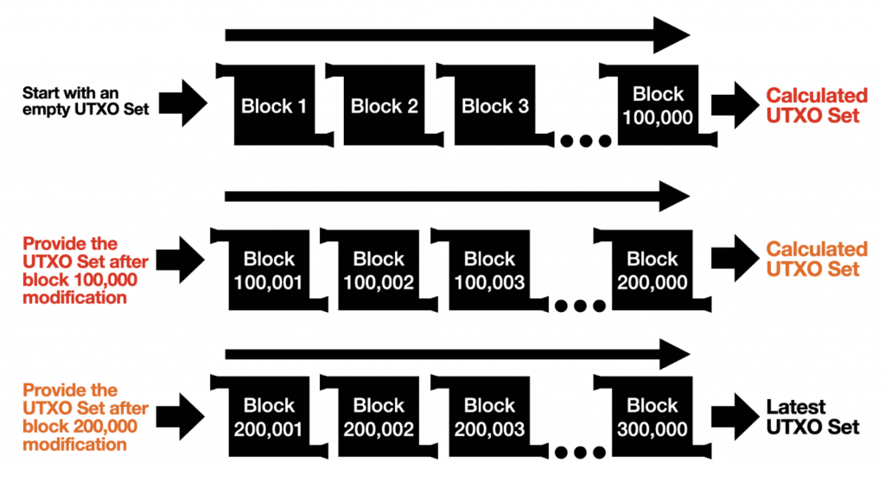

# Advanced Chain Validation Methods

Before moving on from `floresta-chain` to `floresta-wire`, it's time to understand some advanced validation methods and another `Chain` backend provided by Floresta: the `PartialChainState`.

Although similar to `ChainState`, `PartialChainState` focuses on validating a limited range of blocks rather than the entire chain. This design is closely linked to concepts like **UTXO snapshots** (precomputed UTXO states at specific blocks) and, in particular, **out-of-order validation**, which we’ll explore below.

## Out-of-Order Validation

One of the most powerful features enabled by utreexo is out-of-order validation, which allows **block intervals to be validated independently** if we know the utreexo roots at the start of each interval.

In traditional IBDs, block validation is inherently sequential: a block at height `h` depends on the UTXO set resulting from block `h - 1`, which in turn depends on `h - 2`, and so forth. However, with UTXO set snapshots for specific blocks, validation can become non-linear.



*Figure 5: Visual explanation of three block intervals, starting at block `1`, `100,001`, and `200,001`, that can be validated in parallel if we have the UTXO sets for those blocks. Credit: [original post from Calvin Kim](https://blog.bitmex.com/out-of-order-block-validation-with-utreexo-accumulators/).*

This process remains fully trustless because, at the end, we verify that the resulting UTXO set from one interval matches the UTXO set snapshot used to start the next. For example, in the image, the UTXO set after block `100,000` must match the set used for the interval beginning at block `100,001`, and so on.

Ultimately, the sequential nature of block validation is preserved. The worst outcome is wasting resources if the UTXO snapshots are incorrect, so it's still important to obtain these snapshots from a reliable source, such as hardcoded values within the software or reputable peers.

> #### Out-of-Order Validation Without Utreexo
>
> Out-of-order validation is technically possible without utreexo, but it would require entire UTXO sets for each interval, which would take many gigabytes.
> 
> Utreexo makes this feasible with compact accumulators, avoiding the need for full UTXO set storage and frequent disk reads. Instead, spent UTXOs are fetched on demand from the network, along with their inclusion proofs.

Essentially, we are trading disk operations for hash computations (by verifying merkle proofs and updating roots), along with a slightly higher network data demand. In other words, utreexo enables parallel validation while avoiding the bottleneck of slow disk access.

## Trusted UTXO Set Snapshots

A related but slightly different concept is the `Assume-Utxo` feature in `Bitcoin Core`, which hardcodes a trusted, recent UTXO set hash. When a new node starts syncing, it downloads the corresponding UTXO set from the network, verifies its hash against the hardcoded value, and temporarily assumes it to be valid. Starting from this snapshot, the node can quickly sync to the chain tip (e.g., if the snapshot is from block `850,000` and the tip is at height `870,000`, only 20,000 blocks need to be validated to get a synced node).

This approach bypasses most of the IBD time, enabling rapid node synchronization while still silently completing IBD in the background to fully validate the UTXO set snapshot. It builds on [the `Assume-Valid` concept](ch02-03-building-the-chainstate.md#the-assume-valid-lore), relying on the open-source process to ensure the correctness of hardcoded UTXO set hashes.

This idea, adapted to Floresta, is what we call `Assume-Utreexo`, a hardcoded UTXO snapshot in the form of utreexo roots. These hardcoded values are located in _pruned_utreexo/chainparams.rs_, alongside the `Assume-Valid` hashes.

```rust
# // Path: floresta-chain/src/pruned_utreexo/chainparams.rs
#
impl ChainParams {
    pub fn get_assume_utreexo(network: Network) -> AssumeUtreexoValue {
        let genesis = genesis_block(Params::new(network.into()));
        match network {
            Network::Bitcoin => AssumeUtreexoValue {
                block_hash: BlockHash::from_str(
                    "00000000000000000000569f4d863c27e667cbee8acc8da195e7e5551658e6e9",
                )
                .unwrap(),
                height: 855571,
                roots: [
                    // Hardcoded roots are here
                    # "4dcc014cc23611dda2dcf0f34a3e62e7d302146df4b0b01ac701d440358c19d6",
                    # "988e0a883e4ad0c5559432f4747395115112755ec1138dcdd62e2f5741c31c2c",
                    # "49ecba683e12823d44f2ad190120d3028386d8bb7860a3eea62a250a1f293c60",
                    # "7c02e55ae35f12501134f0b81a351abb6c5e7a2529641d0c537a7534a560c770",
                    # "59cb07c73d71164ce1a4f953cfd01ef0e3269080e29d34022d4251523cb1e8ac",
                    # "ff96c9983b6765092403f8089fe5d0cdd6a94c58e4dcd14e77570c8b10c17628",
                    # "47ed934529b2ea03a7382febcf0c05e0bfc5884cc1235c2ad42624a56234b9a6",
                    # "d5c9373ed35de281d426888bd656f04a36623197a33706932ab82014d67f26ae",
                    # "05de50991df991f0b78d9166d06ce3c61cb29e07dc7c53ba75d75df6455e6967",
                    # "ebfdaf53b7240e9cd25d7c63b35d462763253f9282cc97d8d0c92ea9ade6aa02",
                    # "c349b6850f75346224cf7cf1e0a69e194306c59489017cd4f4a045c001f1fefc",
                    # "7edfd925905e88fd14c47edaaf09606cf0ae19f3b898239a2feb607d175d9a90",
                    # "442dadd38fd16949d2ef03d799aa6b61ad8c0b7c611aaa5e218bc6360c4f41ce",
                    # "2a57b73e540c7a72cb44fdc4ab7fcc3f0f148be7885667f07fce345430f08a15",
                    # "66dc66000a8baaacacef280783a0245b4d33bd7eba5f1f14b939bd3a54e135cb",
                    # "67ba89afe6bce9bafbf0b88013e4446c861e6c746e291c3921e0b65c93671ba3",
                    # "972ea2c7472c22e4eab49e9c2db5757a048b271b6251883ce89ccfeaa38b47ab",
                ]
                .into_iter()
                .map(|x| BitcoinNodeHash::from_str(x).unwrap())
                .collect(),
                leaves: 2587882501,
            },
            Network::Testnet => AssumeUtreexoValue {
                // ...
                # block_hash: genesis.block_hash(),
                # height: 0,
                # leaves: 0,
                # roots: Vec::new(),
            },
            Network::Signet => AssumeUtreexoValue {
                // ...
                # block_hash: genesis.block_hash(),
                # height: 0,
                # leaves: 0,
                # roots: Vec::new(),
            },
            Network::Regtest => AssumeUtreexoValue {
                // ...
                # block_hash: genesis.block_hash(),
                # height: 0,
                # leaves: 0,
                # roots: Vec::new(),
            },
        }
    }
    // ...
    #
    # pub fn get_assume_valid(network: Network, arg: AssumeValidArg) -> Option<BlockHash> {
        # fn get_hash(hash: &str) -> BlockHash {
            # BlockHash::from_str(hash).expect("hardcoded hash should not fail")
        # }
        # match arg {
            # AssumeValidArg::Disabled => None,
            # AssumeValidArg::UserInput(hash) => Some(hash),
            # AssumeValidArg::Hardcoded => match network {
                # Network::Bitcoin => {
                    # get_hash("00000000000000000000569f4d863c27e667cbee8acc8da195e7e5551658e6e9")
                        # .into()
                # }
                # Network::Testnet => {
                    # get_hash("000000000000001142ad197bff16a1393290fca09e4ca904dd89e7ae98a90fcd")
                        # .into()
                # }
                # Network::Signet => {
                    # get_hash("0000003ed17b9c93954daab00d73ccbd0092074c4ebfc751c7458d58b827dfea")
                        # .into()
                # }
                # Network::Regtest => {
                    # get_hash("0f9188f13cb7b2c71f2a335e3a4fc328bf5beb436012afca590b1a11466e2206")
                        # .into()
                # }
            # },
        # }
    # }
}
```

If you click _see more_, you will notice we have 17 utreexo roots there, and this is the accumulator for more than 2 billion UTXOs!

### PoW Fraud Proofs Sync

PoW Fraud Proofs Sync is yet another technique to speedup node synchronization, which was ideated by [Ruben Somsen](https://gnusha.org/pi/bitcoindev/CAPv7TjYspkc1M=TKmBK8k0Zy857=bR7jSTarRDCr_5m2ktYHDQ@mail.gmail.com/). It is similar in nature to running a light or SPV client, but with almost the security of a full node. This is the most powerful IBD optimization that Floresta implements, alongside `Assume-Utreexo`.

The idea that underlies this type of sync is that we can treat blockchain forks as potential-fraud proofs. If a miner creates an invalid block (violating consensus rules), honest miners will not mine on top of such block. Instead, honest miners will fork the chain by mining an alternative, valid block at the same height.

As long as a small fraction of miners remains honest and produces at least one block, a non-validating observer can interpret blockchain forks as indicators of _potentially invalid blocks_, and will always catch any invalid block.

The PoW Fraud Proof sync process begins by **identifying the most PoW chain**, which only requires downloading block headers:

- _If no fork is found_, the node assumes the most PoW chain is valid and begins validating blocks starting close to the chain tip.
- _If a fork is found_, this suggests a potential invalid block in the most PoW chain (prompting honest miners to fork away). The node downloads and verifies the disputed block, which requires using the UTXO accumulator for that block. If valid, the node continues following the most PoW chain; if invalid, it switches to the alternative branch.

This method bypasses almost entirely the IBD verification while maintaining security. It relies on a small minority of honest hashpower (e.g., ~1%) to fork away from invalid chains, which we use to detect the invalid blocks.

> In short, **PoW Fraud Proofs Sync requires at least some valid blocks to be produced for invalid ones to be detected**, whereas a regular full node, by validating every block, can detect invalid blocks even with 0% honest miners (though in that extreme case, the entire network would be in serious trouble 😄).

Hence, a PoW Fraud Proof synced node is vulnerable only when the Bitcoin chain is halted for an extended period of time, which would be catastrophic anyway. Check out [this blog post](https://blog.dlsouza.lol/2023/09/28/pow-fraud-proof.html) by Davidson for more details.
